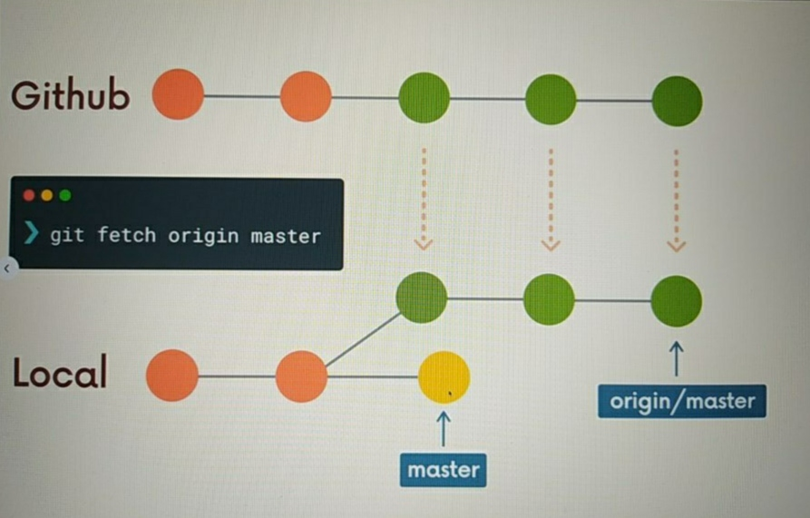

# SSH
[About SSH](https://docs.github.com/en/authentication/connecting-to-github-with-ssh/about-ssh)

# Remote
Remote, github vb platformlardaki repolar ile bağlantımızdır.

    git remote  
    git remote -v

## add
    git remote add <name> <url>

## rename
    git remote rename <oldname> <newname>

## remove
    git remote remove <name>

# Push

    git push <remote> <branch>

`-u` ile push komutunun kısayolunu oluşturabiliriz

    git push -u origin main == git push

local ve remote branch farklı isimlerde ise;

    git push <remote> <localbranch>:<remotebranch>

# Branchlerle ilgili daha fazla bilgi

## adını değiştirme
Örneğin master, main değişikliğini localde de uygulayabilmek için;

    git branch -M <newname>
    
    //master branchindeyken
    git branch -M main

## listeleme

    git branch -r //remote branchleri listeler

# Fetch

git pull vs git fetch: (git dökümanında yazan)
In its default mode, `git pull` is shorthand for `git fetch` followed by `git merge FETCH_HEAD`.

    git fetch <remote>
    git fetch <remote> <branch>

# Pull
git pull = git fetch + git merge

    git pull <remote> <branch>
    git pull 
