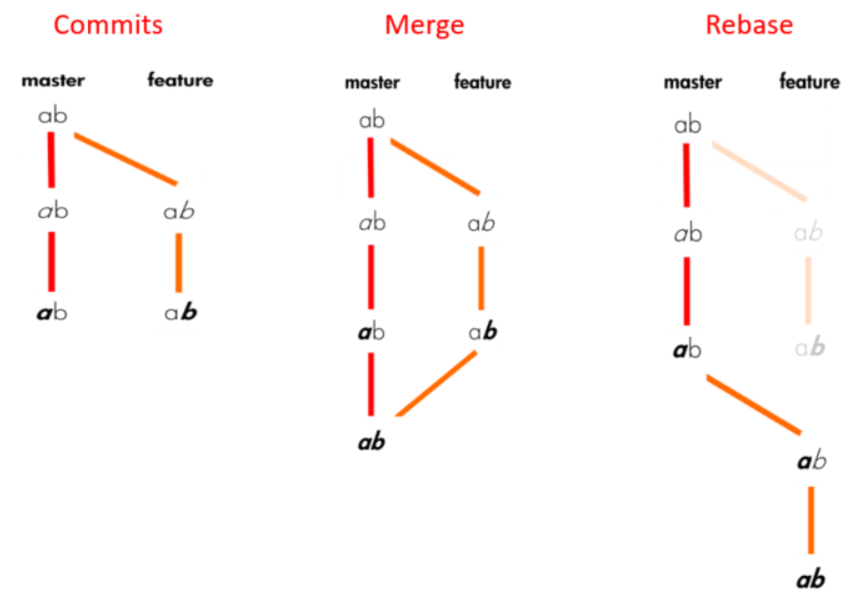

# Rebase
Merge gibi ama aynı zamanda git geçmişini de değiştirir. O yüzden kullanırken dikkatli olmak gerekir

tekrar yazma, silme, yeniden adlandırma, reorder gibi fonksiyonları rebase ile gerçekleştirmek mümkün

# Interactive rebase

    git rebase -i HEAD~4 //nereye dönmek istiyosan

bu komutu kullanınca o heade kadarki commitleri gösteren bir editör açılıyor ve alttaki keywordler sayesinde commitleri düzenleyebiliyoruz.

* pick: o commiti kullan
* reword: o commiti kullan ve commit mesajını güncelle
* edit: use and amend?
* fixup: o commit içeriğini kullan ve önceki commitle birleştir
* drop: commiti siler

